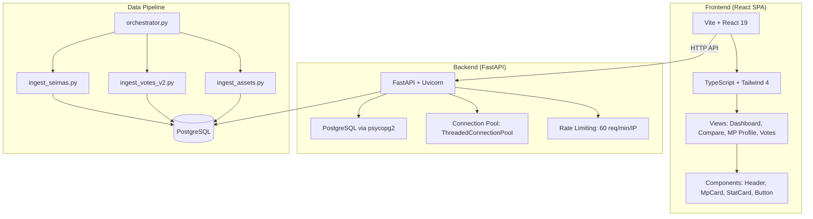
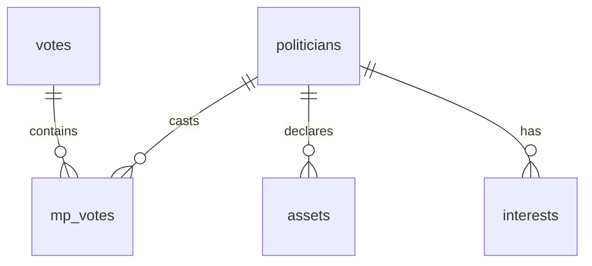

# Skaidrus Seimas - Project Context

> **Project**: Lithuanian Parliament Transparency Dashboard  
> **Type**: Full-stack web application (brownfield)  
> **Last Updated**: 2026-02-04

## 🎯 Project Overview

**Skaidrus Seimas** ("Transparent Seimas") is a civic transparency platform that aggregates, analyzes, and visualizes data about Lithuanian Members of Parliament (MPs). It enables citizens to:

- Browse and search MP profiles
- Compare voting records between MPs
- Track individual votes and voting patterns
- Analyze party alignment and "rebel" votes

---

## 🏗️ Architecture



---

## 📁 Project Structure

```
transparency_project/
├── backend/                    # FastAPI backend
│   └── main.py                 # All API endpoints + static file serving
├── dashboard/                  # React frontend (Vite)
│   ├── src/
│   │   ├── views/              # Page-level components
│   │   │   ├── DashboardView.tsx
│   │   │   ├── ComparisonView.tsx
│   │   │   ├── MpProfileView.tsx
│   │   │   ├── VotesListView.tsx
│   │   │   └── VoteDetailView.tsx
│   │   ├── components/         # Reusable UI components
│   │   │   ├── Header.tsx
│   │   │   ├── MpCard.tsx
│   │   │   └── StatCard.tsx
│   │   ├── stories/            # Storybook stories
│   │   └── App.tsx             # Hash-based routing
│   └── package.json
├── *.py                        # Data ingestion scripts
│   ├── ingest_seimas.py        # MPs from Seimas API
│   ├── ingest_votes_v2.py      # Voting records
│   ├── ingest_assets.py        # Asset declarations
│   └── orchestrator.py         # Data sync coordinator
├── schema.sql                  # Database schema
├── nixpacks.toml               # Railway deployment config
└── requirements.txt            # Python dependencies
```

---

## 🗄️ Database Schema

| Table | Purpose | Key Fields |
|-------|---------|------------|
| `politicians` | MP master table | `id` (UUID), `display_name`, `current_party`, `seimas_mp_id` |
| `votes` | Parliamentary votes | `seimas_vote_id`, `title`, `sitting_date`, `result_type` |
| `mp_votes` | Individual MP voting records | `vote_id`, `politician_id`, `vote_choice` |
| `assets` | Financial declarations (VMI) | `politician_id`, `year`, `total_value` |
| `interests` | Conflict of interest filings | `politician_id`, `interest_type`, `description` |

### Key Relationships


---

## 🔌 API Endpoints

| Endpoint | Method | Description |
|----------|--------|-------------|
| `/api/stats` | GET | Dashboard statistics (MP count, vote count) |
| `/api/activity` | GET | Recent voting activity feed |
| `/api/mps` | GET | List all active MPs |
| `/api/mps/{id}` | GET | Single MP details |
| `/api/mps/{id}/votes` | GET | MP's voting history |
| `/api/mps/compare?ids=` | GET | Compare 2-4 MPs voting alignment |
| `/api/votes` | GET | List recent votes (paginated) |
| `/api/votes/{id}` | GET | Vote details with per-MP breakdown |
| `/health` | GET | Health check with DB status |

---

## 🎨 Frontend Stack

- **Framework**: React 19 with TypeScript
- **Bundler**: Vite 6
- **Styling**: Tailwind CSS 4 (PostCSS)
- **Animation**: Framer Motion
- **Icons**: Lucide React
- **Testing**: Vitest + Playwright + Storybook

### Routing (Hash-based SPA)
```typescript
// Routes defined in App.tsx
#/          → DashboardView
#/mps       → MpsListView
#/mps/:id   → MpProfileView
#/votes     → VotesListView  
#/votes/:id → VoteDetailView
#/compare   → ComparisonView
```

---

## 🚀 Deployment

**Platform**: Railway (Nixpacks)

```toml
# nixpacks.toml
[phases.setup]
nixPkgs = ["python3", "nodejs_20", "postgresql_16", "gcc"]

[phases.build]
cmds = ["cd dashboard && npm run build", "pip install -r requirements.txt"]

[start]
cmd = "python -m uvicorn backend.main:app --host 0.0.0.0 --port ${PORT:-8000}"
```

**Monolithic Deployment**: Backend serves both API (`/api/*`) and static React build (`/`, `/*`).

---

## 🔧 Development Commands

```bash
# Backend
cd transparency_project
python -m uvicorn backend.main:app --reload

# Frontend
cd dashboard
npm run dev          # Vite dev server (port 5173)
npm run storybook    # Storybook (port 6006)
npm run test         # Vitest

# Data Sync
python orchestrator.py  # Run full data pipeline
```

---

## 📊 Data Sources

| Source | Data | Ingestion Script |
|--------|------|------------------|
| Seimas OpenData API | MP profiles | `ingest_seimas.py` |
| Seimas Voting API | Vote records | `ingest_votes_v2.py` |
| VMI (Tax Authority) | Asset declarations | `ingest_assets.py` |
| VRK (Electoral Commission) | Candidate linking | `link_vrk.py` |

---

## ⚠️ Critical Patterns for AI Agents

> [!IMPORTANT]
> **Connection Pooling**: Always use `with get_db_conn() as conn:` context manager
> 
> **Rate Limiting**: API enforces 60 req/min/IP via `check_rate_limit()`
>
> **Static File Serving**: Backend mounts `dashboard/dist/` at root - API routes take precedence

> [!CAUTION]
> **UUID Casting**: PostgreSQL queries must cast explicitly: `WHERE id = %s::uuid`
>
> **Vote Choice Values**: Lithuanian text: `'Už'`, `'Prieš'`, `'Susilaikė'`, `'Nedalyvavo'`

---

## 🧪 Testing Strategy

- **Unit Tests**: `tests/` directory (Vitest/pytest)
- **Component Stories**: `dashboard/src/stories/` (Storybook 8.5)
- **E2E**: Playwright via `@vitest/browser-playwright`

---

## 📝 Environment Variables

| Variable | Required | Description |
|----------|----------|-------------|
| `DB_DSN` | Yes | PostgreSQL connection string |
| `PORT` | No | Server port (default: 8000) |
